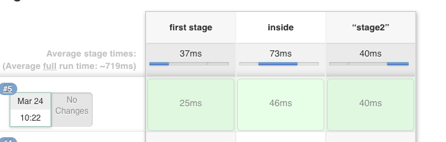
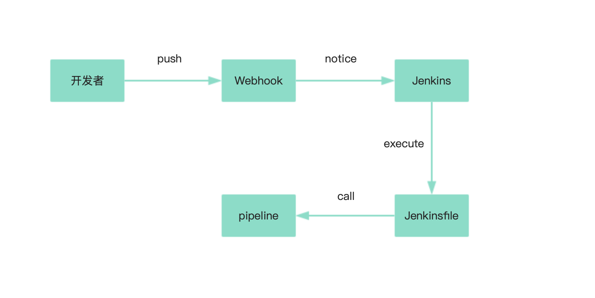

## 前端部署


如果我要部署自己的博客，一般需要以下几步：

1. 使用 webpack 编译代码，产出静态资源
2. 打开 FTP 软件，上传服务器替换文件
3. 看看网站是否在线上工作正常
4. 将本地代码提交


随之而来的问题：

1. 手动部署成本太高
2. 本地和线上环境可能会不一致
3. 遇到线上问题难以排查


该怎么解决这些问题呢？


## 虚拟机


虚拟机一般是通过某种软件来实现的。

通过硬件虚拟化的功能，可以模拟出一台或者多台计算机的各种硬件。

在上面安装一个新的操作系统，即 Guest OS。

用户可以在这一台虚拟机上安装、运行操作系统和各种应用，解决了环境不一致的问题。


缺点：
1. 资源占用多
2. 冗余步骤多
3. 启动慢


## Docker


在一艘大船上，可以把货物放到集装箱中，集装箱彼此之间不会互相影响。

这样就不需要专门装水果的船和专门装化学品的船了。

只要这些货物在集装箱里封装的好好的，那我就可以用一艘大船把他们都运走。


Docker 是一个开源的应用容器引擎，基于 Go 语言 并遵从 Apache2.0 协议开源。

Docker 可以让开发者打包他们的应用以及依赖包到一个轻量级、可移植的容器中，然后发布到任何流行的 Linux 机器上，也可以实现虚拟化。


Docker 技术的三大核心概念，分别是：

1. 镜像（Image）
2. 容器（Container）
3. 仓库（Repository）


一个 Dockerfile 文件：

```
FROM nginx

COPY ./index.html /usr/share/nginx/html/index.html

EXPOSE 80
```


一个完整的 Docker 运行：

```
docker image build ./ -t my-docker:1.0.0 # 打包镜像

docker container create -p 8080:80 my-docker:1.0.0 # 创建容器

docker container start xxx # xxx 为上条命令运行的结果
```


## 什么是 CI/CD？


工厂里的装配线以快速、自动化、可重复的方式从原材料生产出消费品。

同样，软件交付以快速、自动化和可重复的方式从源代码生成发布版本。


如何完成这项工作的总体设计称为“持续交付”（CD）。

启动装配线的过程称为“持续集成”（CI）。


确保质量的过程称为“持续测试”，将最终产品提供给用户的过程称为“持续部署”。

一些专家让这一切简单、顺畅、高效地运行，这些人被称为运维开发 DevOps 践行者。


## 持续

持续不是指“一直在进行”，而是“随时可进行”，一般来说包括这几个方面：

- 频繁发布
- 自动化流程
- 可重复
- 快速迭代


## 什么是持续交付管道

将源代码转换为可发布产品的多个不同的任务 task 和作业 job 通常串联成一个软件“管道”，一个自动流程成功完成后会启动管道中的下一个流程。

这些管道有许多不同的叫法，例如持续交付管道、部署管道和软件开发管道。

大体上讲，程序管理者在管道执行时管理管道各部分的定义、运行、监控和报告。


引入 CI/CD 以后，整个流程变成：

1. 本地机器上写代码
2. 提交代码，push 到 git 远程仓库
3. git hook 触发 jenkins 的构建 job （自动）
4. jenkins job 中拉取项目代码，运行 npm run build，如果失败，发送邮件通知相关人。（自动）
5. jenkins job 中执行测试服务器的部署脚本 （自动）


## Webhook

> Events are at the core of webhooks. These webhooks fire whenever a certain action is taken on the repository, which your server's payload URL intercepts and acts upon.


CI/CD 的关键在于自动化，使用脚本来自动化构建、部署，而 Webhook 则起到了中间桥梁的作用。

Webhook 简单来说就是一种反向 API 机制，是在特定情况下触发的一种 API，类似于触发器。


Github 的 Webhook：


## Travis CI

Travis CI 提供的是持续集成服务（Continuous Integration，简称 CI）。

它绑定 Github 上面的项目，只要有新的代码，就会自动抓取。


提供一个运行环境，完成构建，还能部署到服务器。

这些行为都可以在项目根目录的 .travis.yml 配置文件里面指定。


一般有下面几个阶段：

1. 安装依赖阶段
2. 运行脚本阶段
3. 部署阶段（非必须）


## Github Actions


持续集成由很多操作组成，比如抓取代码、运行测试、登录远程服务器，发布到第三方服务等等。

GitHub 把这些操作就称为 actions。


在这个仓库的 .github/workflows 目录，生成一个 workflow 的 yml 文件，即可以使用 Github Actions。

整个持续集成过程，就变成了一个 actions 的组合。


GitHub 还提供了[官方市场](https://github.com/marketplace?type=actions)，允许开发者把每个操作写成独立的脚本文件，存放到代码仓库，使得其他开发者可以引用。


GitHub Actions 有一些自己的术语。

1. workflow：持续集成一次运行的过程，就是一个 workflow。

2. job：一个 workflow 由一个或多个 jobs 构成，含义是一次持续集成的运行，可以完成多个任务。

3. step：每个 job 由多个 step 构成，一步步完成。

4. action：每个 step 可以依次执行一个或多个命令（action）。


## Jenkins


Jenkins 是一个基于 Java 开发的持续集成工具，用于监控持续重复的工作。

旨在提供一个开放易用的软件平台，使软件的持续集成变成可能。


通常与版本管理工具(SCM)、构建工具结合使用。

常用的版本控制工具有 SVN、GIT，构建工具有Maven、Ant、Gradle。

依托于 Jenkins 的平台，可以使用各种插件和脚本来实现自动化的构建、部署流程。


## Jenkins 流水线（pipeline）


Pipeline，简而言之，就是一套运行于Jenkins上的工作流框架。

将原本独立运行于单个或者多个节点的任务连接起来，实现单个任务难以完成的复杂流程编排与可视化。

Pipeline 允许编写更加灵活的脚本，去控制整个工作流程。


Jenkins pipeline 有两种语法：

1. Declarative 声明式（偏配置化）

2. Scripted Pipeline 脚本式（基于 Groovy 语言）


声明式：

```
#!/usr/bin/env groovy

pipeline {
    //  声明参数 
    parameters {
        string(name:'dev_server', defaultValue: 'IP,Port,Name,Passwd', description: '开发服务器(IP,Port,Name,Passwd)')
        string(name:'alT19_server', defaultValue: 'IP,Port,Name,Passwd', description: ' 生产服务器(IP,Port,Name,Passwd)')
    }
    environment {
        TEST_EMAIL='Tester'
    }
    stages {
        stage('Checkout') {
            steps {
                script {
                // 拉取代码
            }
        }
        stage('构建') {
            steps {
                sh "mvn -Dmaven.test.failure.ignore clean install"
            }
        }
        stage('部署到测试环境') {
            steps {
                echo 'Deploying to test_server'
            }
        }
        stage('部署生产环境') {
            steps {
                echo 'Deploying to prod_server'
            }
        }
    }   
}
```


stage 是每个 pipeline 阶段，steps 则是对 stage 的描述，而 script 则是一些 Groovy 的逻辑脚本。




脚本式：

```
node {
    stage('Example') {
        if (env.BRANCH_NAME == 'master') {
            echo 'I only execute on the master branch'
        } else {
            echo 'I execute elsewhere'
        }
    }
}
```


我们项目中的：




